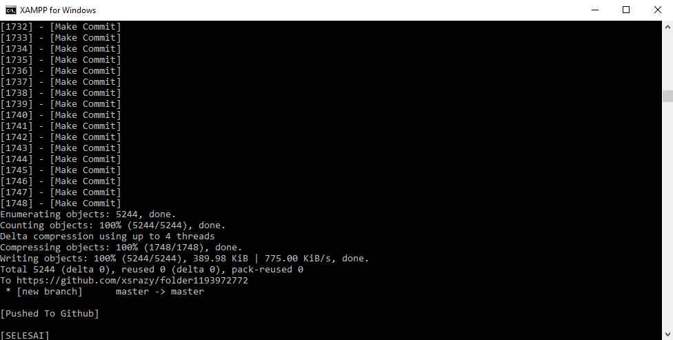

🌳 Making green your Github stats, powered by [Github Actions](https://github.com/features/actions)
 

<h3>Bahasa Indonesia</h3>
<bt/>

 

## Cara ambil akses token:
- Buka setting
- Developer setting
- pilih Personal Access Token
- Generate new token
- Isi Note terserah
- Expiration pilih No Expiration
- Centang semua, Generate token
- Simpen tokennya
 

## Cara menjalankannya menggunakan Termux:
- pkg update
- pkg upgrade -y
- pkg install git
- pkg install php -y
- git clone https://github.com/xsrazy/github-auto-commit
- cd github-auto-commit
- nano config.php
- masukin token & username
- git config --global user.email "email-mu@gmail.com"
  (pake tanda petik dua)
- git config --global user.name "username-mu"
  (pake tanda petik dua dan tanpa tanda @)
- php run.php
 

## Cara menjalankannya menggunakan Laptop/PC:
- Install php / xampp
- git clone https://github.com/xsrazy/github-auto-commit
- cd github-auto-commit
- edit config.php
- masukin token & username
- git config --global user.email "email-mu@gmail.com"
  (pake tanda petik dua)
- git config --global user.name "username-mu"
  (pake tanda petik dua dan tanpa tanda @)
- php run.php
- mau pull berapapun terserah bebas, gw test 1748 masuk commitnya.
 

## Sumber dari segala sumber
- [Ad-m](https://github.com/ad-m)
- [Mazipan](https://github.com/mazipan)
- [Erastimothy](https://github.com/erastimothy)
- [Sharing Gils Blog](https://github.com/xsrazy)
 

## Hehe

